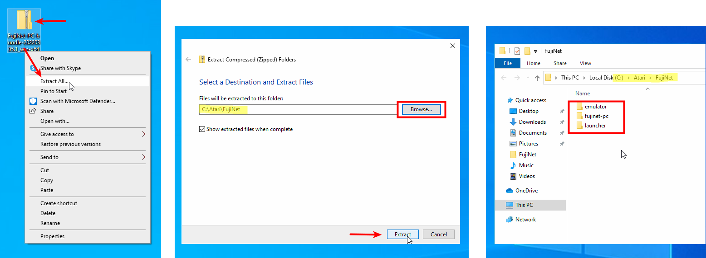
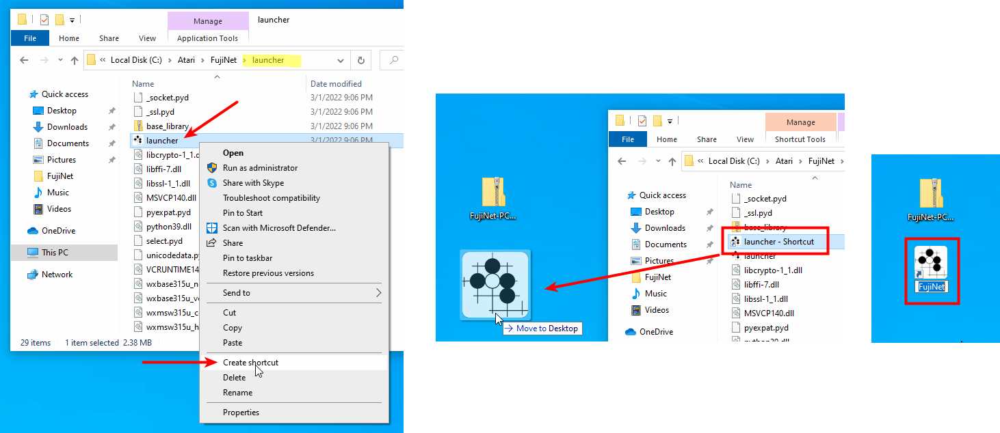
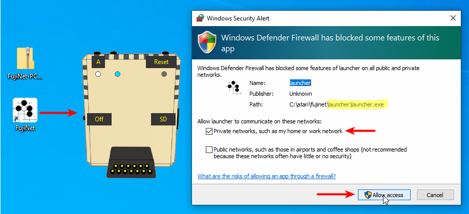
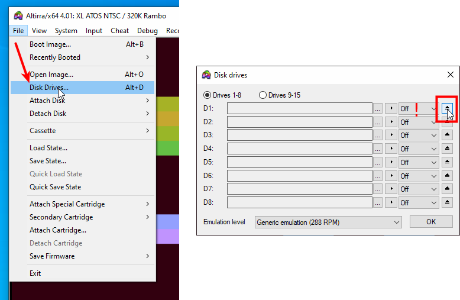
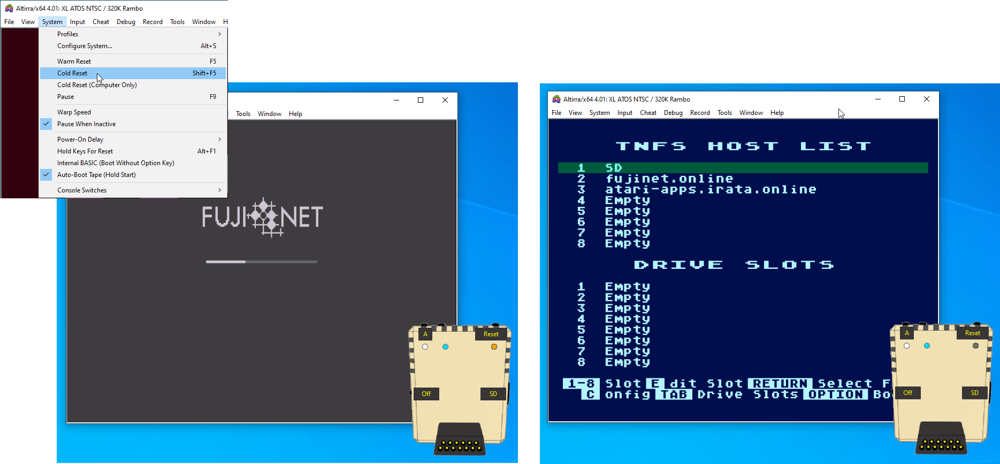

# Installation

FujiNet-PC Launcher is bundled together with Fujinet-PC, NetSIO hub and custom device file for Altirra into one FujiNet-PC bundle.

## Windows

### 1) Get the bundle file and unzip it

Create / use the directory of your choice for extracted files, e.g. `FujiNet`.

### 2) Create shortcut to launcher.exe

For your convenience create a shortcut to `launcher.exe` and move it to Desktop (or some other place of your choice). Shortcut can be given some nicer name.

### 3) Start FujiNet-PC Launcher

When started for the first time, Operating System may ask for security confirmation.

### 4) Connect Altirra with FujiNet

In Altirra, navigate to menu `System` > `Configure System...` In `Configure System` window navigate to `Peripherals` > `Devices` and `Add` custom device. Use `...` button to navigate to `emulator\Altirra-4.0x` and select `netsio.atdevice` file. Once added, the device will be listed as `NetSIO - SIO over network` custom device.

### 5) Disable Fast boot acceleration

To allow emulated Atari boot from from FujiNet via custom device the Fast boot acceleration feature must be disabled.

### 6) Detach Altirra's D1: drive

To boot from FujiNet (acting as D1:), similar to real Atari, there cannot be multiple D1: drives attached to SIO bus. Detach other D1: if any.

### 7) Boot emulated Atari from FujiNet

To simulate power cycle of both Atari and FujiNet one can use `Cold Reset`. To "power cycle" Atari only use `Cold Reset (Computer Only)`.

Enjoy!
